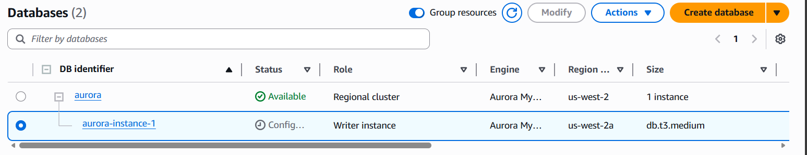
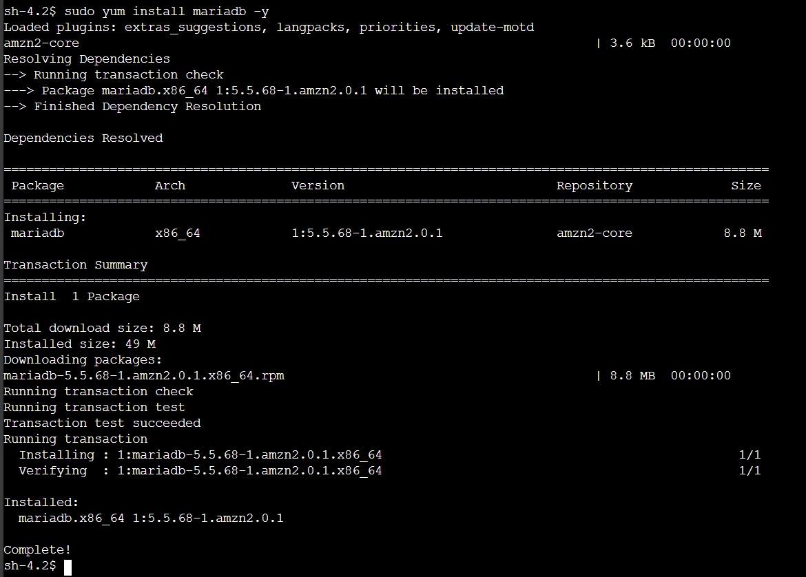
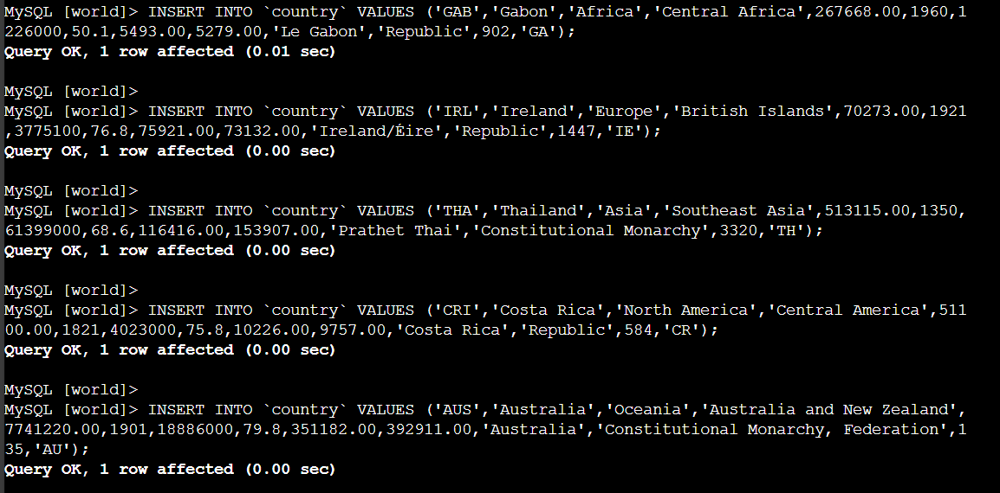
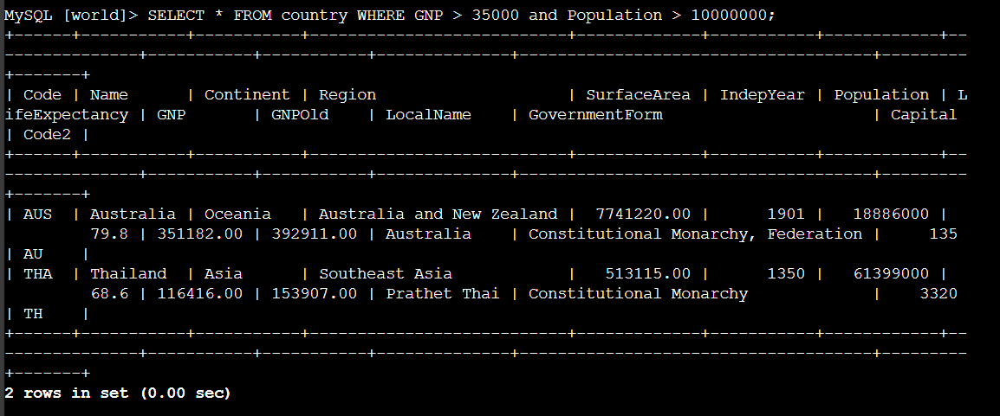

##  Amazon Aurora Lab: My Journey Through EC2 Connectivity & SQL Interaction

This lab was focused on building a resilient Aurora database cluster and connecting it to an EC2 instance for SQL operations. Here's how I did it.

---

##  1. Creating the Amazon Aurora DB Cluster

I launched an Aurora cluster via the **Amazon RDS Console**, selecting:
- **Standard create**
- **Engine type**: Aurora (MySQL-compatible)
- **Edition**: Aurora MySQL

I configured the cluster with:
- **DB cluster identifier**: `aurora`
- **Instance class**: `db.t3.medium`
- **Multi-AZ deployment**: Enabled
- **Storage type**: General Purpose SSD (gp2)

I set up connectivity:
- **VPC**: My custom VPC
- **DB Subnet Group**: Spanning 2 Availability Zones
- **Public access**: Disabled
- **Security group**: Allowed inbound MySQL (port 3306)

I enabled:
- **Performance Insights**
- **Encryption** with default AWS KMS key

Then I waited for the cluster status to change from **Configuring** to **Available**.  


 **Result**: Aurora DB cluster was successfully created and ready for connections.

---

##  2. Connecting to a Pre-Created EC2 Instance

I connected to my EC2 instance using SSH:
```bash
ssh -i your-key.pem ec2-user@your-ec2-public-ip
```

Then I installed the MariaDB client to interact with Aurora:
```bash
sudo yum install mariadb -y
```  


 **Result**: CLI tool installed and ready for SQL interaction.

---

##  3. Configuring EC2 to Connect to Aurora

I ensured:
- EC2’s security group allowed outbound traffic
- Aurora’s security group allowed inbound MySQL (TCP 3306) from EC2’s security group

Then I retrieved the **Writer endpoint** from the RDS Console:  


 **Result**: EC2 and Aurora were securely connected.

---

##  4. Querying the Aurora Database

###  Step 1: Connect via CLI  
I connected to Aurora using the MySQL client:
```bash
mysql -h aurora-endpoint -u main -p
```

###  Step 2: Create & Populate Table  
I created the `world` database and a `country` table with rich schema:  


###  Step 3: Insert Sample Data  
I inserted multiple sample records including Australia and Thailand:  


###  Step 4: Run Queries  
I ran a query to filter countries with high GNP and population:
```sql
SELECT * FROM country WHERE GNP > 35000 AND Population > 10000000;
```  


 **Result**: Aurora responded with matching rows instantly.

---

##  Final Verification Checklist

- [x] Aurora DB cluster created and available  
- [x] EC2 instance connected and configured  
- [x] Security groups allow DB access  
- [x] SQL queries executed successfully  


