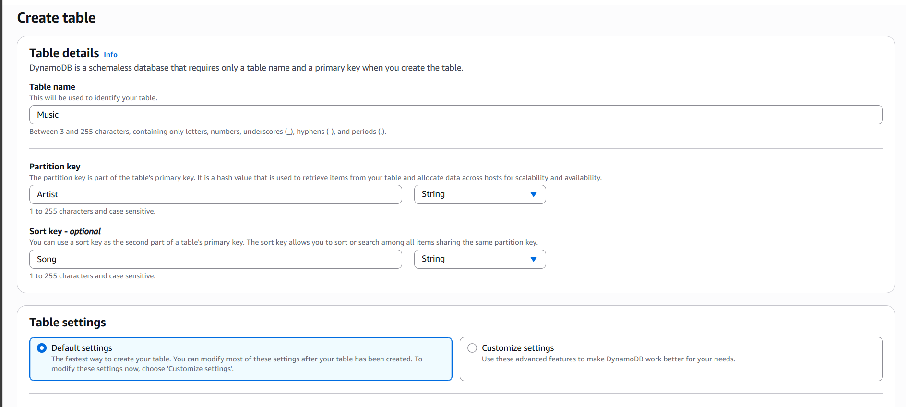
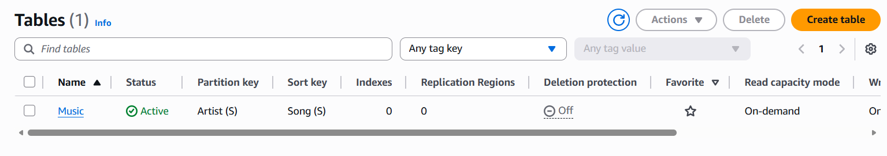
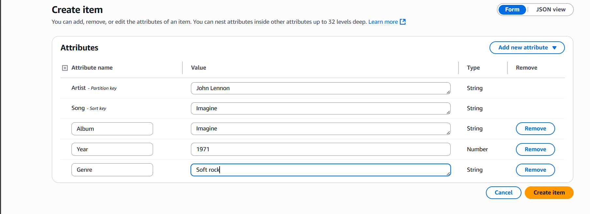
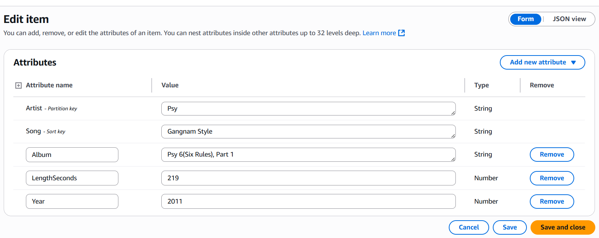
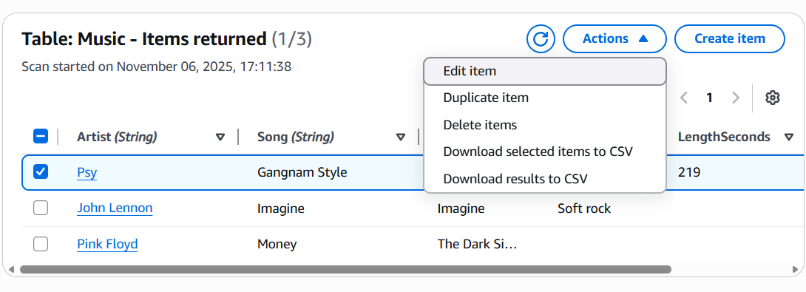
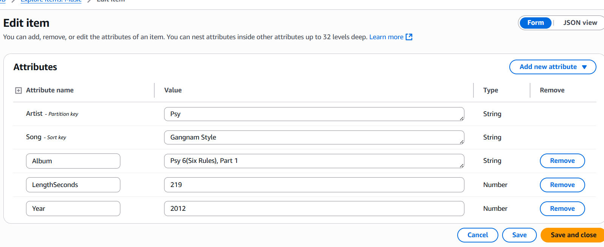
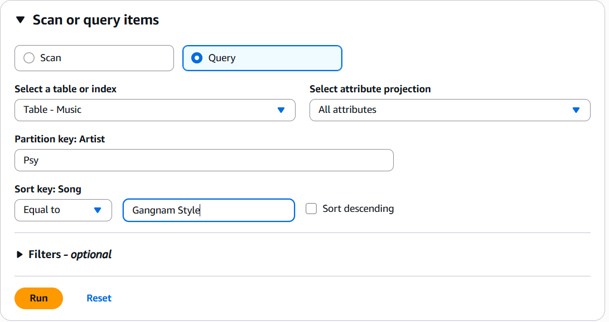

## 🎵 Amazon DynamoDB Lab: My Journey Through Table Creation, Data Entry & Querying

This lab was all about modeling structured music data using Amazon DynamoDB. Here's how I built and queried a music metadata table step by step.

---

##  1. Creating the Amazon DynamoDB Table

###  Step 1: Navigate to DynamoDB Console  
I started by heading to the AWS Console → DynamoDB → Tables → Create Table.

###  Step 2: Define Table Schema  
I named the table `Music`, set the **partition key** to `Artist` (String), and the **sort key** to `Song` (String). I chose **Default settings** to enable on-demand capacity mode.  

**Result**: The `Music` table was created with a composite key schema.  

---

##  2. Entering Data into the DynamoDB Table

###  Step 1: Add Items via Console  
I used the **Form view** to enter structured attributes for each music item.

#### 🎶 Entry 1: Pink Floyd  
- Artist: Pink Floyd  
- Song: Money  
- Album: The Dark Side of the Moon  
- Year: 1973  
- LengthSeconds: 382  
- Genre: Progressive Rock  

#### 🎶 Entry 2: John Lennon  
- Artist: John Lennon  
- Song: Imagine  
- Album: Imagine  
- Year: 1971  
- LengthSeconds: 183  
- Genre: Soft Rock  

#### 🎶 Entry 3: Psy  
- Artist: Psy  
- Song: Gangnam Style  
- Album: Psy 6 (Six Rules), Part 1  
- Year: 2012  
- LengthSeconds: 219  
- Genre: K-pop  

After saving each item, I got a success confirmation:  

 **Result**: All items were successfully saved and visible in the table scan.  

I also explored how to edit items using both views:  
- Form view:  
    
- JSON view:  
  

---

##  3. Querying the DynamoDB Table

###  Step 1: Use Query Interface  
I queried the table using the following conditions:
- Partition key: `Artist = Psy`  
- Sort key: `Song = Gangnam Style`  
- Projection: All attributes  

### Step 2: Run Query  
I clicked **Run**, and the result returned full metadata for Psy’s hit track.  

 **Result**: The query executed with 100% efficiency and minimal RCUs.

---

##  Final Verification Checklist

- [x] Table `Music` created with composite key  
- [x] Items inserted with rich metadata  
- [x] Query returned expected results  
- [x] Data editable via Form or JSON view  

-
