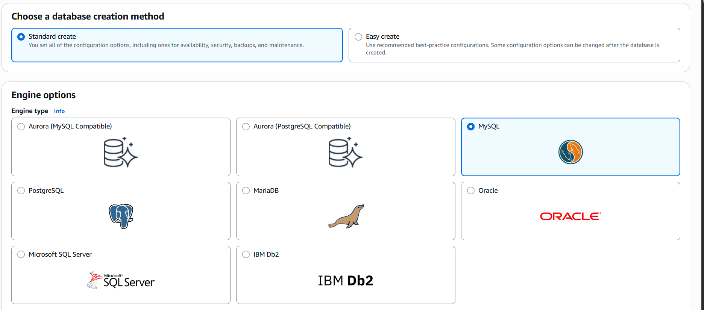
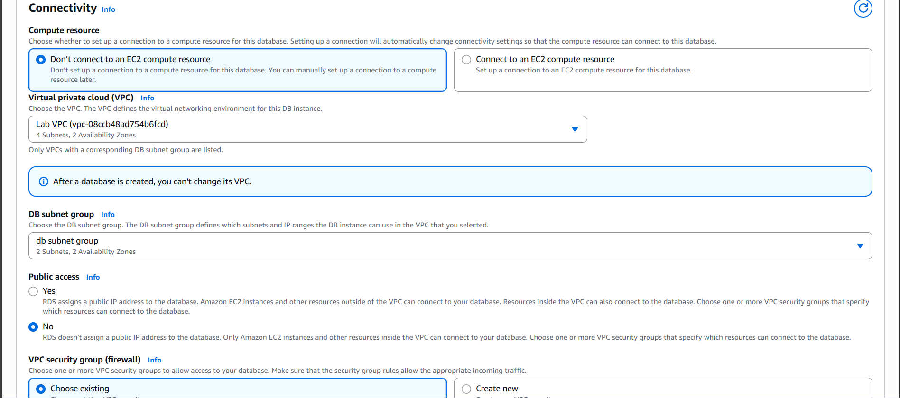
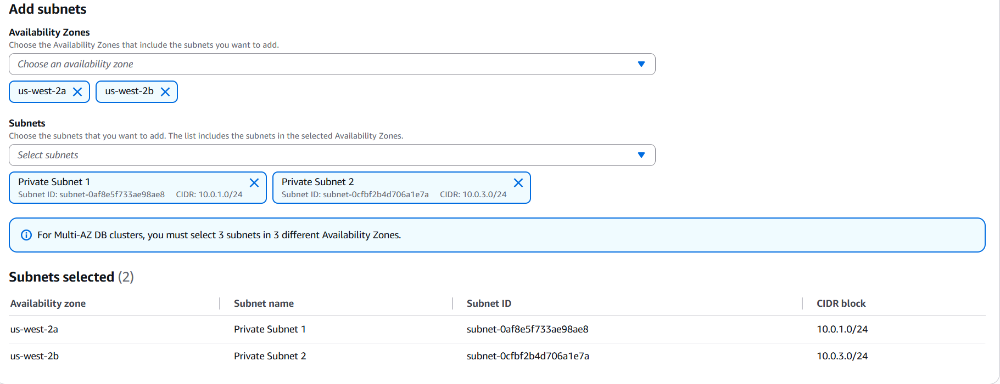
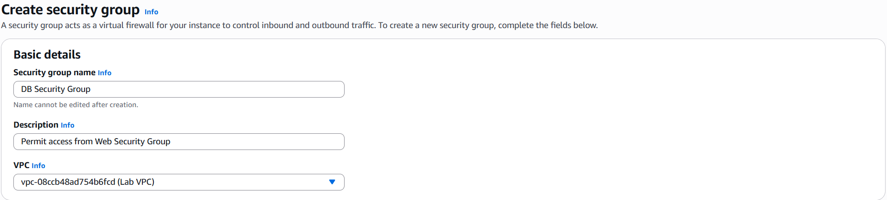
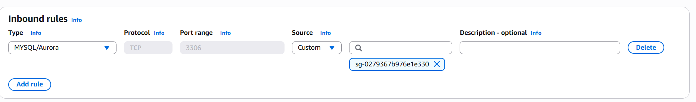
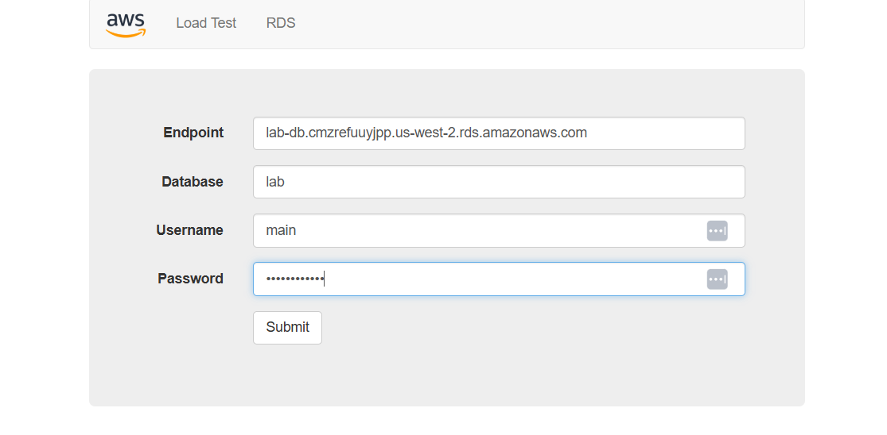
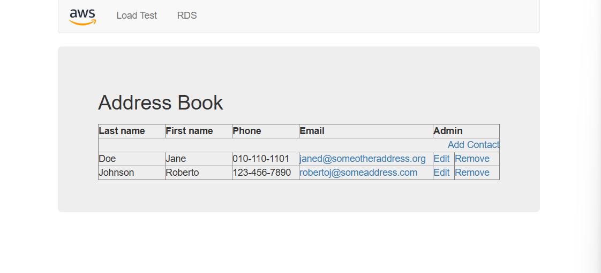

##  Amazon RDS Lab: My Journey to High Availability, Secure Connectivity & Web Integration

This lab was all about building a robust, secure, and scalable backend using Amazon RDS and integrating it with a web application. Here's how I did it — step by step.

---

##  1. Launching a Highly Available Amazon RDS MySQL Instance

###  Step 1: Creation Method  
I started in the **Amazon RDS Console** and chose **Standard Create** because I wanted full control over every configuration detail.  

###  Step 2: Engine Selection  
I selected **MySQL** as the database engine since it's widely supported and perfect for my web app.  

###  Step 3: Deployment Template  
I picked the **Production** template to ensure high availability and durability.  

###  Step 4: Settings  
I named the instance `lab-db`, set the master username to `main`, and manually created a strong password to keep things secure.  

###  Step 5: Instance Configuration  
I chose the `db.t3.medium` instance class for a balance of performance and cost, and allocated `200 GiB` of General Purpose SSD storage.  

###  Step 6: Connectivity  
I connected the instance to my custom VPC (`Lab VPC`) and used a DB subnet group with **2 private subnets** across different AZs. I disabled public access to keep the database private and selected a security group for access control.  
  

###  Step 7: Monitoring  
I enabled **Performance Insights** with a 7-day retention period and used the default KMS key for encryption.  

###  Step 8: Additional Configuration  
I named the initial database `lab`, used default parameter and option groups, enabled encryption, and selectively enabled log exports.  

 **Result**: My RDS instance `lab-db` was successfully launched with Multi-AZ high availability and encryption enabled.

---

##  2. Configuring DB Access from Web Server

###  Step 1: Security Groups

####  Web Security Group  
I created a security group named `Web Security Group` to allow HTTP and HTTPS traffic from anywhere.  

####  DB Security Group  
Then I created `DB Security Group` to permit MySQL access from the web server. I linked it to the same VPC and added an inbound rule for port `3306`, sourced from the Web Security Group.  
  

 **Result**: My web server could securely connect to the RDS instance.

---

##  3. Connecting the Web Application to RDS

###  Step 1: Retrieve RDS Endpoint  
Once the instance was live, I grabbed the endpoint:  
`lab-db.cmzreufuyjpp.us-west-2.rds.amazonaws.com`  

###  Step 2: Configure Web App  
I plugged the endpoint and credentials into my app’s database config:
- Endpoint: `lab-db.cmzreufuyjpp.us-west-2.rds.amazonaws.com`
- Database: `lab`
- Username: `main`
- Password: `your-password`

###  Step 3: Launch Web App  
I deployed the app on EC2 and ensured it used the `Web Security Group`. Then I connected to RDS using a MySQL client and verified backend connectivity.

###  Step 4: Interact with DB  
I built a simple **Address Book Web App** that lets users add, edit, and remove contacts. The backend connects to RDS using the credentials above.  

**Result**: The web app successfully interacts with the RDS database.

---

##  Final Verification Checklist

- [x] RDS instance launched with Multi-AZ  
- [x] Security groups configured for DB access  
- [x] Web app connected and interacting with DB  
- [x] Monitoring and encryption enabled

