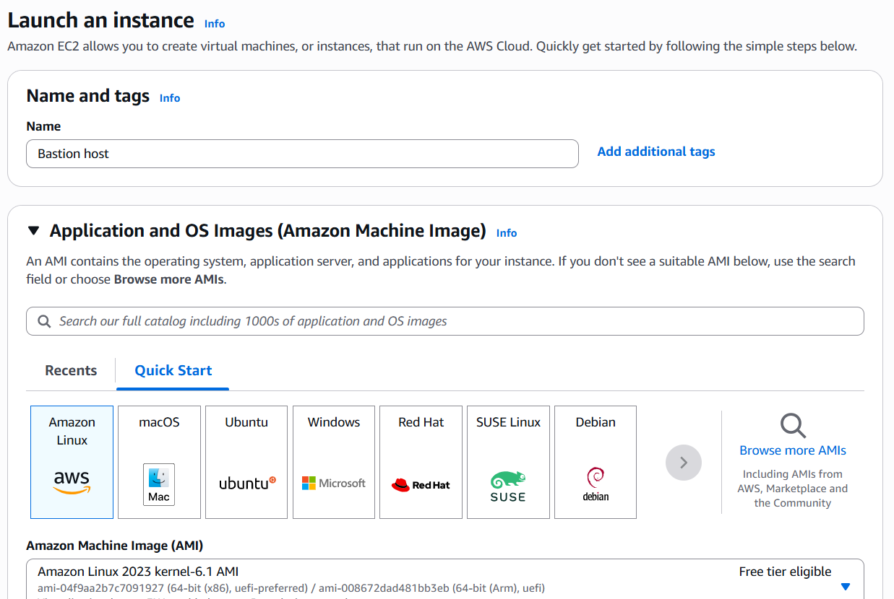
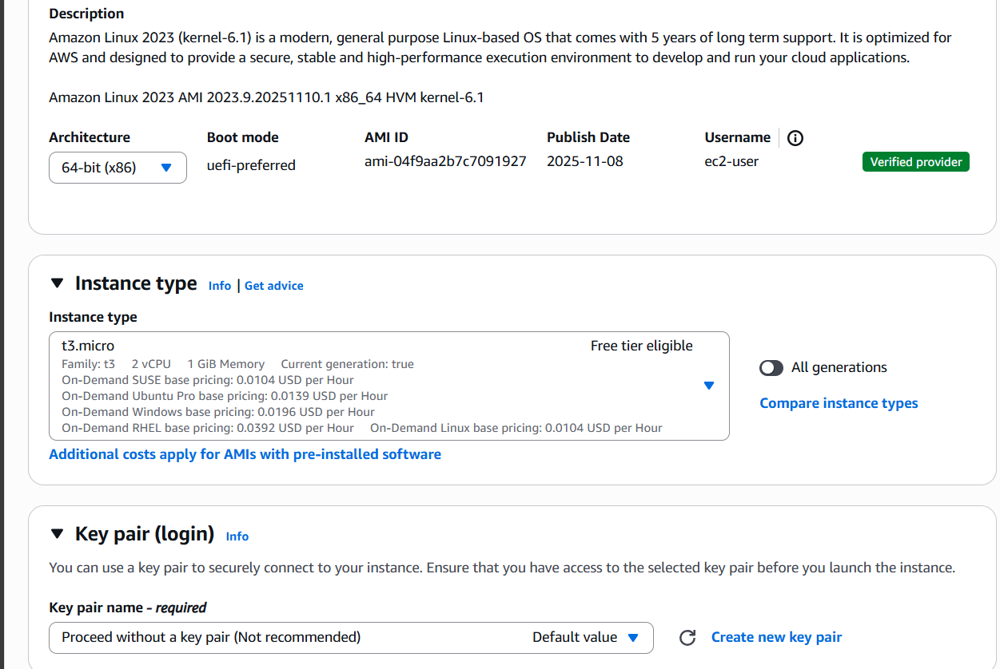
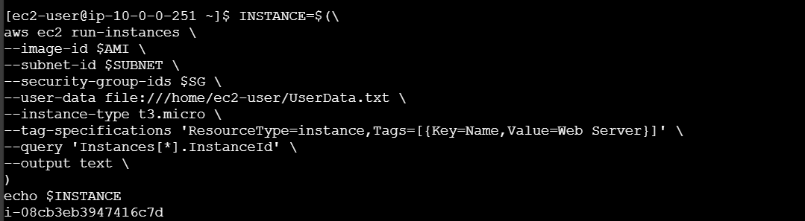
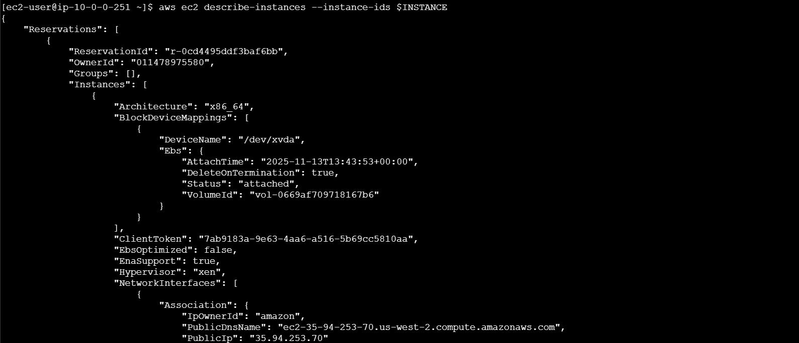

##  Amazon EC2 Lab: My Journey Through Launching and Connecting via Console and CLI

This lab was all about launching a secure EC2 instance and connecting to it using both the AWS Console and CLI. Here's how I did it — step by step.

---

##  1. Launching an EC2 Instance via AWS Management Console

###  Step-by-Step Configuration

#### 🔹 Start the Launch Process  
I began by heading to the **EC2 Dashboard** and clicking **Launch Instance**. I named my instance `Bastion host`.  


#### 🔹 Choose an Amazon Machine Image (AMI)  
I selected the **Amazon Linux 2023 kernel-6.1 AMI**, which is free tier eligible and optimized for AWS.  


#### 🔹 Choose Instance Type  
I went with `t3.micro` — 2 vCPUs, 1 GiB RAM — perfect for testing and free tier eligible.

#### 🔹 Key Pair (Login)  
For this lab, I proceeded without a key pair, though this isn’t recommended for production.

#### 🔹 Network Settings  
I configured the instance to use my **Lab VPC** and selected a **Public Subnet** in `us-east-1a`. I enabled auto-assign public IP and created a security group named `bastion security group` to allow SSH traffic.  


#### 🔹 Storage Configuration  
I kept the root volume at `8 GiB`, used `gp3` with `3000 IOPS`, and left it unencrypted.  


#### 🔹 Advanced Details  
I assigned the IAM role `Bastion-Role`, set the hostname type to IP name, enabled IPv4 DNS options, and chose “Stop” for shutdown behavior.  


 **Result**: EC2 instance launched successfully.

---

##  2. Connecting via EC2 Instance Connect

Once the instance was running, I used **EC2 Instance Connect** to log in via browser-based SSH.  
 I was logged in as `ec2-user` and ready to go.

---

##  3. Launching an EC2 Instance via AWS CLI

### 🔹 Prerequisites  
I made sure the AWS CLI was installed and configured, then downloaded the `UserData.txt` script from S3:
```bash
curl -o UserData.txt https://aws-c2-labprojects.s3.us-west-2.amazonaws.com/CS-1307/2023/Lab-1/UserData.txt
```

### 🔹 Retrieve Required Parameters  
I retrieved the latest Amazon Linux AMI, subnet ID, and security group ID using these commands:  


### 🔹 Launch the Instance  
I launched the instance using this CLI block:
```bash
INSTANCE=$( \
aws ec2 run-instances \
  --image-id $AMI \
  --subnet-id $SUBNET \
  --security-group-ids $SG \
  --user-data file:///home/ec2-user/UserData.txt \
  --instance-type t3.micro \
  --tag-specifications 'ResourceType=instance,Tags=[{Key=Name,Value=Web Server}]' \
  --query 'Instances[0].InstanceId' \
  --output text \
)
echo "Launched Instance ID: $INSTANCE"
```


### 🔹 Verify Instance Status & DNS  
I confirmed the instance was running and retrieved its public DNS:  
  


 **Result**: Instance launched and verified via CLI.

---

##  Final Notes

- Security group rule `0.0.0.0/0` allows access from any IP. For production, restrict to known IP ranges.  
- Free tier includes up to 750 hours/month of `t2.micro` or `t3.micro` usage and 30 GB of EBS storage.  
- Always tag your resources for easier tracking and billing.  

