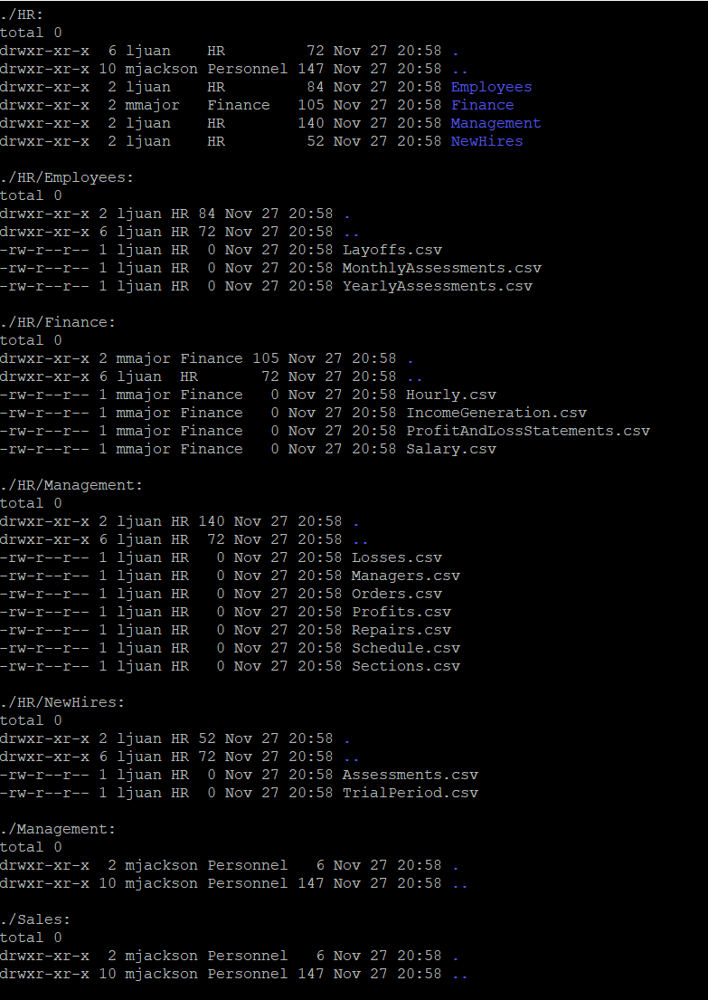

##  Linux Department Directory Setup on EC2: My Step-by-Step Guide

This lab was all about structuring a company directory on EC2 with proper ownership, permissions, and departmental alignment. I created folders, assigned users and groups, and verified everything with recursive checks.

---

##  Prerequisites

- **Access**: SSH into EC2 as a sudo-capable user (`ec2-user`)  
- **Base path**: `/home/ec2-user/companyA`  
- **Users**: `mjackson`, `jlarson`, `ljuan`, `owusu`  
- **Groups**: `Personnel`, `HR`, `Finance`, `Sales`, `Shipping`  
- **Tip**: Always use spaces in commands like `cat /etc/group`, not `cat/etc/group`

---

##  1. Assigning Ownership by Department

I started by assigning ownership and primary groups to each department folder:

```bash
sudo chown -R mjackson:Personnel /home/ec2-user/companyA
cd /home/ec2-user/companyA
sudo chown -R jlarson:HR HR
sudo chown -R rmajor:Finance HR/Finance
```

To verify ownership:
```bash
ls -laR /home/ec2-user/companyA
```


Expected patterns:
- `drwxr-xr-x 2 mjackson Personnel ...`
- `drwxr-xr-x 2 jlarson HR ...`
- `-rw-r--r-- 1 ljuan HR ...`
- `-rw-r--r-- 1 mjmajor Finance ...`

---

##  2. Verifying Permissions

I checked key directories:
```bash
ls -l HR
ls -l Finance
ls -l SharedFolders
```


Expected patterns:
- Directories: `drwxrwxr-x owner group ...`  
- Files: `-rw-rw-r-- owner group ...`

---

##  3. Making Files Executable for Department Members

For department scripts or placeholders:
```bash
sudo chmod 775 Sales/Employees
```

---

##  4. Normalizing the Company Folder Structure

I ensured all top-level folders existed and were owned by `Personnel`:
```bash
sudo mkdir -p CEO Documents Employees HR Finance Management Sales Shipping SharedFolders
sudo chown mjackson:Personnel CEO Documents Employees Management Sales Shipping SharedFolders
sudo chmod 775 CEO Documents Employees Management Sales Shipping SharedFolders
```

For HR substructure:
```bash
sudo mkdir -p HR/Employees HR/Layoffs HR/Management HR/NewHires
sudo chown -R jlarson:HR HR
sudo chmod -R 775 HR
```

For Finance files:
```bash
sudo touch Finance/{MonthlyAssessments.csv,Hourly.csv,FinancialStatements.csv,Salary.csv}
sudo chown rmajor:Finance Finance/*
sudo chmod 664 Finance/*
```

---

##  5. Populating and Setting Ownership for Example Files

HR example files:
```bash
sudo touch HR/Employees/Employees.csv HR/Layoffs/Layoffs.csv HR/NewHires/{NewHires.csv,TrialPeriod.csv}
sudo touch HR/Management/{Losses.csv,Gains.csv,Schedule.csv,Reductions.csv}
sudo chown ljuan:HR HR/Employees/Employees.csv HR/Layoffs/Layoffs.csv HR/NewHires/* HR/Management/*
sudo chmod 664 HR/Employees/Employees.csv HR/Layoffs/Layoffs.csv HR/NewHires/* HR/Management/*
```

Shared folder file:
```bash
sudo touch SharedFolders/logins.csv
sudo chown mjackson:Personnel SharedFolders/logins.csv
sudo chmod 664 SharedFolders/logins.csv
```


---

##  6. Verifying the Entire Tree

```bash
ls -laR /home/ec2-user/companyA
```


Expected:
- Top-level: `mjackson:Personnel`  
- HR subtree: `jlarson:HR`, files by `ljuan:HR`  
- Finance files: `mjmajor:Finance` or `rmajor:Finance`  
- Sales: `mwolf:Sales`, Shipping: `owusu:Shipping`

---

## 7. Quick Checks and Auditing

Check users and groups:
```bash
cut -d: -f1 /etc/passwd
getent group | egrep 'Personnel|HR|Finance|Sales|Shipping'
```

Find world-writable files:
```bash
find /home/ec2-user/companyA -perm -0002 -type f -ls
```

Ensure group-write on directories:
```bash
find /home/ec2-user/companyA -type d ! -perm -002 -printf '%p\n'
```

---

##  Common Pitfalls and Fixes

- **Missing space in commands**  
  Fix: Use `cat /etc/group`, not `cat/etc/group`

- **Group write not applied**  
  Fix:
  ```bash
  find /home/ec2-user/companyA -type d -exec sudo chmod 775 {} \;
  find /home/ec2-user/companyA -type f -exec sudo chmod 664 {} \;
  ```

- **Ownership inconsistent after moves/copies**  
  Fix:
  ```bash
  sudo chown -R <owner>:<group> /home/ec2-user/companyA/<Dept>
  ```

- **Execute bit missing on directories**  
  Fix:
  ```bash
  find /home/ec2-user/companyA -type d -exec sudo chmod u+x,g+x {} \;
  ```

