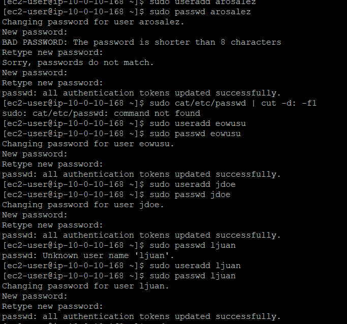
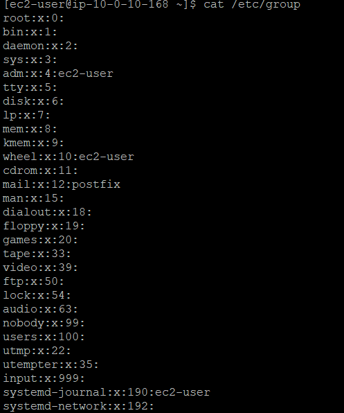

##  Linux User & Group Setup on EC2: My Step-by-Step Guide

This lab was all about managing users and groups on a Linux EC2 instance. I created users, set passwords, built department groups, and assigned memberships — all with verification and troubleshooting built in.

---

##  Prerequisites and Context

- **Environment**: Amazon Linux on EC2  
- **Access**: Logged in as `ec2-user` with sudo privileges  
- **Goal**: Create users, assign default passwords, create groups, and manage memberships safely  
- **Tip**: Spacing matters — use `cat /etc/group`, not `cat/etc/group`

---

##  1. Creating Users with Default Passwords

###  Step 1: Create the Users  
I added four users using `useradd`:
```bash
sudo useradd arosalez
sudo useradd eowusu
sudo useradd jdoe
sudo useradd lijuan
```

To verify they were created:
```bash
cut -d: -f1 /etc/passwd | egrep 'arosalez|eowusu|jdoe|lijuan'
```


### Step 2: Set Default Passwords  
I used `passwd` interactively for each user:
```bash
sudo passwd arosalez
sudo passwd eowusu
sudo passwd jdoe
sudo passwd lijuan
```


**Notes**:
- Use 8+ characters to avoid weak password warnings  
- If you see “Sorry, passwords do not match,” just re-run `passwd`

###  Optional: Force Password Change at First Login  
```bash
sudo chage -d 0 arosalez
sudo chage -d 0 eowusu
sudo chage -d 0 jdoe
sudo chage -d 0 lijuan
```

To verify:
```bash
sudo chage -l arosalez | head -n 5
```

---

##  2. Creating Department Groups

###  Step 1: Add Groups  
I created seven department groups:
```bash
sudo groupadd Sales
sudo groupadd Shipping
sudo groupadd HR
sudo groupadd Finance
sudo groupadd Personnel
sudo groupadd CEO
sudo groupadd Managers
```


### 🔍 Step 2: Verify Groups  
```bash
getent group | egrep 'Sales|Shipping|HR|Finance|Personnel|CEO|Managers'
```

Expected output pattern:


---

##  3. Assigning Users to Groups

### Step 1: Append Users to Groups  
I used `usermod -a -G` to preserve existing memberships:
```bash
sudo usermod -a -G HR arosalez
sudo usermod -a -G Shipping eowusu
sudo usermod -a -G Finance lijuan
```


### Step 2: Verify Membership  
```bash
getent group HR
getent group Shipping
getent group Finance
```

Expected pattern:
```
HR:x:1007:arosalez
Shipping:x:1006:eowusu
Finance:x:1008:lijuan
```

###  Step 3: Confirm User Group Sets  
```bash
id arosalez
id eowusu
id jdoe
id lijuan
```

---

##  Quick Verification Checklist

- **List all users**:
  ```bash
  cut -d: -f1 /etc/passwd
  ```
  

- **List all groups**:
  ```bash
  cat /etc/group
  ```
  

- **Check login shell and home directory**:
  ```bash
  getent passwd arosalez
  ```

- **Test password change flow**:
  ```bash
  sudo passwd arosalez
  ```

---

##  Troubleshooting Tips

- **Command not found or file not found**  
  - Cause: Missing space (e.g., `cat/etc/group`)  
  - Fix: Use `cat /etc/group`

- **Weak password warning**  
  - Cause: Password too short or fails policy  
  - Fix: Use longer, more complex password

- **Membership not showing after usermod**  
  - Cause: Used `usermod -G` without `-a`  
  - Fix: Re-run with `usermod -a -G <group> <user>`

- **Group not found**  
  - Cause: Group not created or typo  
  - Fix: Run `getent group <GroupName>`; if missing, use `sudo groupadd <GroupName>`


