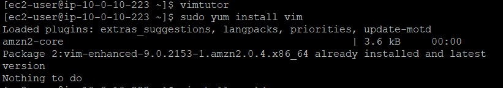

##  Vim on Linux: My Lightweight Power Editing Setup

Vim is my go-to terminal editor — fast, efficient, and perfect for editing files directly on EC2. Whether I’m tweaking config files, writing scripts, or working over SSH, Vim gives me full control with minimal overhead.

---

##  Why I Use Vim

- Edit files directly in the terminal — no GUI needed  
- Navigate large files with lightning speed  
- Search and replace using powerful regex  
- Customize with plugins and `.vimrc` settings  
- Use macros and scripting for automation  
- Work remotely via SSH with full editing capabilities  

---

##  How I Installed Vim on Linux

These steps work on most Debian-based and Red Hat-based distros. I was using Amazon Linux on EC2.

### 🔹 Step 1: Update the Package Manager  
```bash
sudo yum update        # For CentOS/RHEL or Amazon Linux
```

### 🔹 Step 2: Install Vim  
```bash
sudo yum install vim
```

Result: Vim was already installed and up to date on my EC2 instance.  


---

##  Launching Vim  
Once installed, I simply typed:
```bash
vim
```
Or for the tutorial:
```bash
vimtutor
```

---

##  Bonus Tip  
To make Vim my default editor for system tasks like `crontab` or `git commit`, I ran:
```bash
export EDITOR=vim
```

---


